# Progra-Mobil-Entregable---3


La aplicación a desarrollar se tratará de un registrador de votaciones. El usuario ingresa al login y verá dos pestañas. Una en la que tendrá que votar por una opción y la otra donde verá el recuento de votos que hicieron los demás usuarios. Para realizar el proyecto, necesitaremos de ionic como framework gratuito. Además, es open source _codiog libre_ lo que permite que cualquiera pueda editar, agregar o eliminar código según le parezca. Dicho framework ayudará a crear apps estables y rápidas mediante el uso de HTML5, CSS, Angular JS o React.


## Instalación 🔧

Para instalar ionic primero debemos de instalar el node js. Para ello ingresamos al siguiente link:
[Instalar Node js](https://nodejs.org/en/download)
 

### Instalar node js 
---

**Paso 1: Descargar el archivo ejecutable**

Seleccionar la opcion correspondiente al sistema operativo a ejecutar.
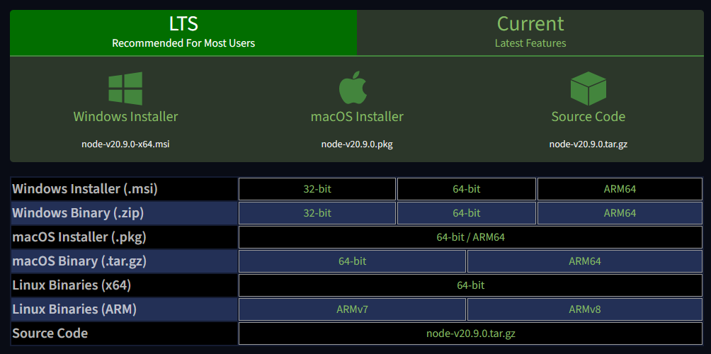

**Paso 2: Abrir el archivo descargado, con extension _".msi"_**

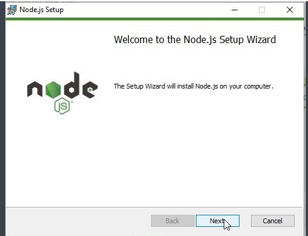

**Paso 3: Aceptamos terminos y condiciones**
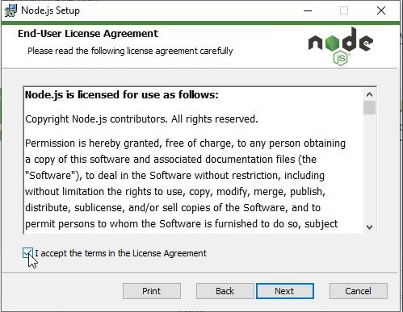

**Paso 4: Ubicamos la ruta de guardado**
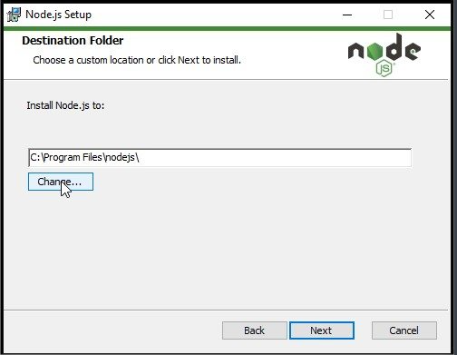

**Paso 5: Aceptar instalar herramientas adicionales**

La siguiente pestaña le daremos a _Instalar_
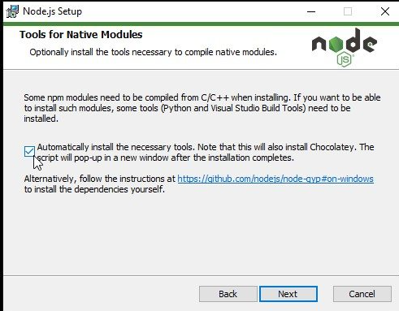

### Probar instalacion de node js 
---
**Paso 1: instalar ionic**
_Debes ingresar al buscador "cmd" para abrir el Simbolo de sistema. En el, debes ingresar el siguiente codigo:_
```
node -v
```
Se mostrara la siguiente imagen:

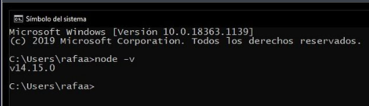

### Instalar ionic
---
_Debemos ingresar el siguiente comando en el cmd_
```
npm install -g ionic
```
_Luego comprobamos la instalacion con:_
```
ionic --version
```
Se mostrara la siguiente imagen:
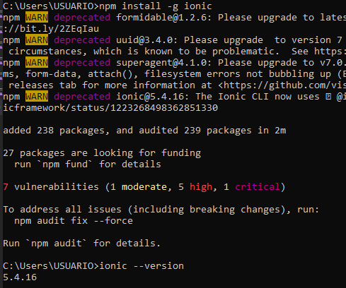

**Paso 2: Crear proyecto**

El siguiente paso sera crear una carpeta:
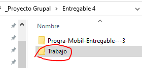

Luego, escribimos cmd en su ruta y le damos a enter:
_Te deberia abrir un cmd_

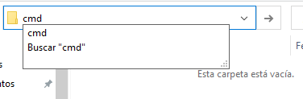

Ingresaremos el siguiente comando:
_podemos personalizar el nombre del proyecto y agregamos "tabs/sidemenu/blank" segun nos convenga_

tabs = tablas, sidemenu = menu o blank = completamente en blanco.

```
ionic start “nombre” blank
```
Deberia quedar asi:

_Nos pedira elegir un framework, en este caso elegimos react._


Si tenemos el proyecto de esta forma significa que el proyecto esta creado:

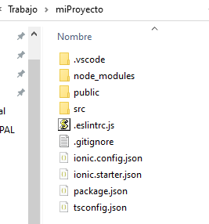

**Paso 3: Instalar dependencias**

Escribimos cmd en la ruta del proyecto y le damos a enter.

_Luego, ingresamos el siguiente comando para poder verlo en el navegador:_
```
ionic serve
```

Deberia aparecer asi:
_Le damos a "y" para instalar react-scrpits y esperamos unos minutos._
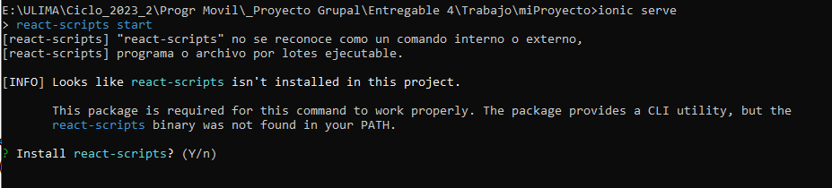

### Fuentes
---
[Guia para instalar ionic](https://www.digitaldot.es/crear-app-ionic-visual-studio-code/)

[Guia para instalar Node js](https://codigofacilito.com/articulos/instalar-nodejs-windows)

## Diagrama de despliegue 📦
El diagrama de despliegue muestra la arquitectura de una aplicación móvil desarrollada en Ionic, la cual se ejecuta en un dispositivo Android con sistema operativo Android 11. En el lado del servidor web, se empleará Replit Server, que utiliza Node.js y hace uso de la base de datos SQLite3. Finalmente, la aplicación se conecta al servidor backend de Firebase mediante protocolos HTTP y WebSockets.

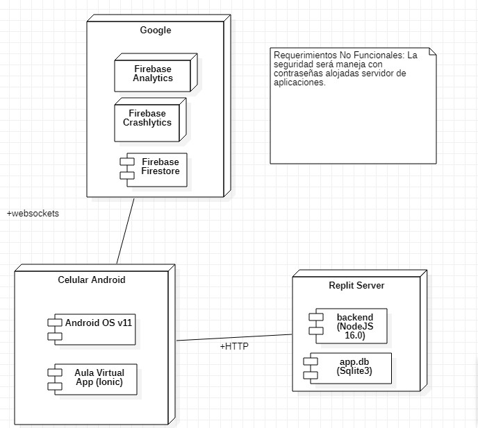


## Requerimientos no funcionales ⚙️

* _El servidor Replit debe de mantenerse activo las 24 horas del día para que los usuarios puedan acceder a la base de datos_
* _El tiempo de respuesta al utilizar la aplicacion debe de ser menor de un segundo_
* _El servidor Firebase debe de reportar detalladamente los errores que puedan haber causado que se caiga la aplicación_
* _Cada día se debe de respaldar la base de datos_
* _Aparte del usuario correspondiente, tan sólo el administrador puede cambiar los datos de la base o los usuarios_
* _Todos los celulares Android siendo distribuidos actualmente deben de ser compatibles con la aplicación_

## Diagrama de casos de uso 📋

Diagrama elaborado relacionado correctamente a los requisitos funcionales:

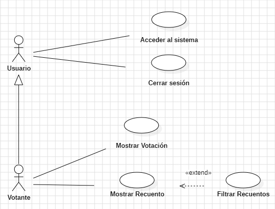

Requisitos funcionales:

* _El usuario verá una SplashScreen al abrir la aplicación_
* _El usuario podrá crearse una cuenta, iniciar sesión y cerrarla_
* _La sesión del usuario se guardará en el Local Storage_
* _El usuario podrá ver los nombres de integrantes del grupo_
* _El votante podrá votar en las votaciones correspondientes a sus respuestas en las preguntas filtro_
* _El votante podrá ver más información de las opciones por las que puede votar_
* _El votante podrá ver el recuento total de todas las votaciones existentes; pudiendo alternar entre ver todas o solo en las que votó_

### Descripción de casos de uso 
Las descripciones están relacionadas correctamente a los
requisitos funcionales y los mockups

### Mockups de la aplicacion 
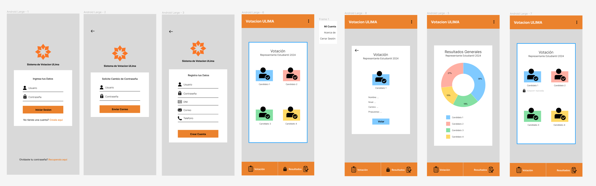


## Construido con 🛠️

* [Figma](https://www.figma.com/) - Elaboracion de Prototipos Visuales

## Autores ✒️

* **Adrián Duarte** - *Diagrama de casos de uso* - [AdriUlima](https://github.com/AdriUlima)
* **Fulanito Detal** - *Documentación* - [fulanitodetal](#fulanito-de-tal)
* **Jean Pierre Tinco** - *Chiste* - [JeanPierreTB](https://github.com/JeanPierreTB)
* **Mario Cartolin** - *Elaboracion de Mockups* - [xsia-o](https://github.com/xsia-o)

También puedes mirar la lista de todos los [contribuyentes](https://github.com/your/project/contributors) quíenes han participado en este proyecto. 

## Licencia 📄

All licenses in this repository are copyrighted by their respective authors. Everything else is released under CC0. See LICENSE for details.
